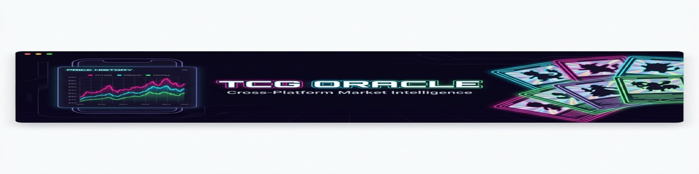
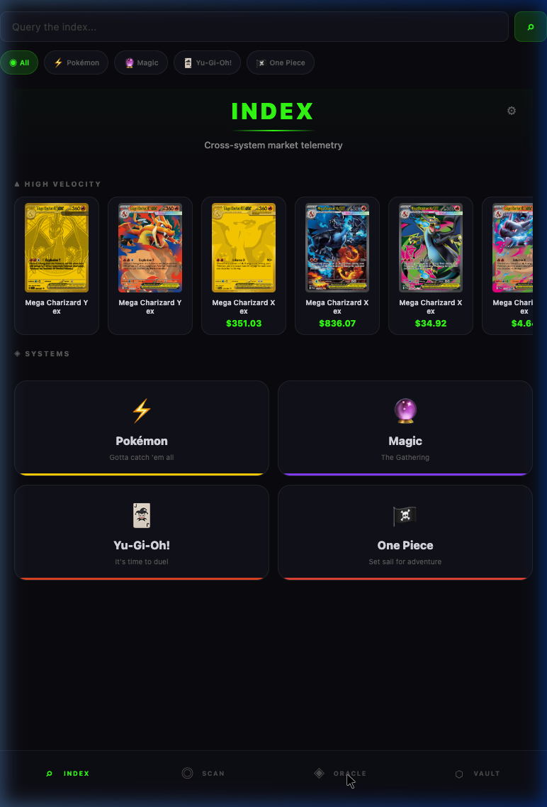
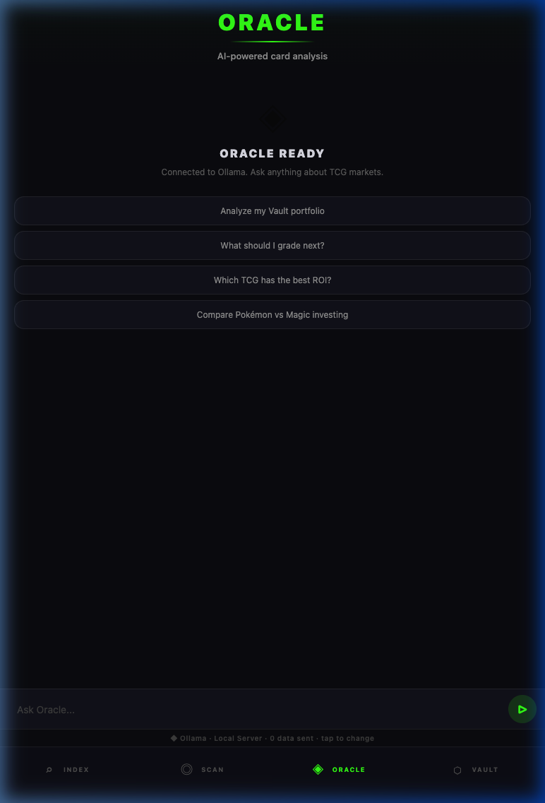
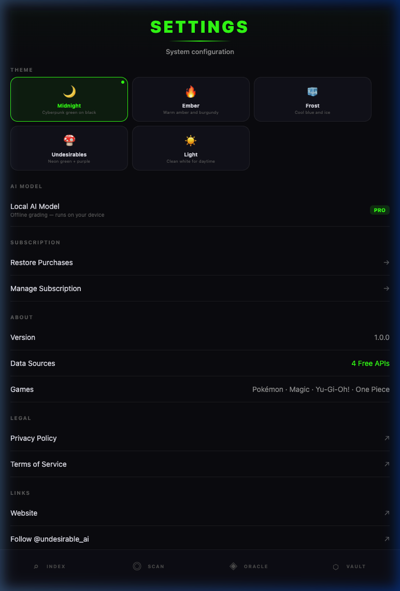

<div align="center">



# TCG Oracle

**Cross-platform market intelligence and AI-powered card grading for trading cards.**

Pokémon · Magic: The Gathering · Yu-Gi-Oh! · One Piece · Lorcana

[](https://tauri.app)
[](https://reactnative.dev)
[](https://expo.dev)
[](https://typescriptlang.org)
[](LICENSE)

[Website](https://the-undesirables.com) · [Releases](https://github.com/sailorpepe/tcg-oracle-app/releases) · [𝕏](https://x.com/undesirables_ai)

</div>

---

<div align="center">


&nbsp;&nbsp;

&nbsp;&nbsp;


</div>

---

## Table of Contents

- [Why Use This?](#why-use-this)
- [Features](#features)
- [Quick Start](#quick-start)
- [AI Engines](#ai-engines)
- [Data Sources](#data-sources)
- [Security](#security)
- [Tech Stack](#tech-stack)
- [Project Structure](#project-structure)
- [Links](#links)
- [License & Commercial Use](#-license--commercial-use)

---

## Why Use This?

Most TCG pricing tools are cloud-locked, ad-heavy, or require paid subscriptions. TCG Oracle is different:

- **100% local** — Zero telemetry, no analytics, no phone-home. All data stays on your device.
- **Truly cross-platform** — Runs on macOS, Windows, Linux, iOS, Android, and Web from a single codebase.
- **AI-powered grading** — Drop a photo of any card and get predicted PSA/BGS grades using your own AI engine.
- **Live market data** — Real-time eBay comps with outlier trimming and fair market value calculation, no API keys required.
- **Bring Your Own Key** — Use Ollama (free, local), Groq (free tier), or Anthropic (Claude) for AI features. No vendor lock-in.
- **Built by collectors** — The CL Value algorithm mirrors real card shop pricing methodology.

---

## Features

### 🔍 Index
Real-time card search across five TCG ecosystems with live eBay market comps. Filter by game, browse high-velocity movers, and dive into individual card details with the CL Value algorithm — the same pricing methodology used by card shops.

### 🛒 eBay Market Comps
Built-in eBay integration pulls live listings, separates graded from raw, trims outliers, and calculates fair market value — no API keys or setup required. Power users can optionally connect their own eBay developer keys for dedicated access.

### 📸 AI Grading & LitVM Notarization
AI-powered card grading on web and mobile. Drag-and-drop a card image (JPG, PNG, HEIC) or use your phone's camera for instant condition analysis — centering, corners, edges, surface — with predicted PSA/BGS grades. Powered by your BYOK AI engine (Anthropic, Groq, or Ollama).

**LitecoinVM (LitVM) Integration:**
Once a card is graded, users can connect their wallet and sign a transaction to **notarize** the grading report immutably on the LitVM LiteForge testnet. This locks the card's data, its AI-predicted grade, and its image hash into our Graded Price Oracle smart contract (`0x36C02dA8a0983159322a80FFE9F24b1acfF8B570`), creating a verifiable, trustless receipt of physical assets for DeFi applications (like LendVault loans).

### 💎 Oracle
AI chat grounded in your Vault portfolio. Ask about card values, meta shifts, grading ROI, or investment timing. Supports Ollama (local), Groq (free tier), and Anthropic (Claude).

### 🏦 Vault & Portfolio Tracking
Personal card watchlist stored entirely on-device. Track your collection's estimated value. Cards that have been notarized on-chain will display a shiny `✅ ON-CHAIN` badge, which links directly to the LitVM block explorer for instant verification. The Oracle reads your Vault to give personalized market advice.

### ⚙️ Settings
Five visual themes (Midnight, Ember, Frost, Undesirables, Light). Custom wallpaper with animated border effects. Engine configuration, eBay integration, and legal links.

---

## Quick Start

```bash
# Clone and install
git clone https://github.com/sailorpepe/tcg-oracle-app.git
cd tcg-oracle-app
npm install

# Run on web
npx expo start --web

# Run on iOS simulator
npx expo start --ios

# Run on Android emulator
npx expo start --android
```

### Desktop (Tauri)

```bash
# Build for macOS
npm run build
cd src-tauri && cargo tauri build

# The DMG/installer will be in src-tauri/target/release/bundle/
```

Pre-built installers are available on the [Releases](https://github.com/sailorpepe/tcg-oracle-app/releases) page.

---

## AI Engines & Bring Your Own Key (BYOK)

TCG Oracle uses a **Bring Your Own Key (BYOK)** model for its AI features (Oracle chat and card grading). This ensures absolute privacy, zero vendor lock-in, and allows you to run the app completely for free if you have the hardware.

| Engine | Type | Setup |
|--------|------|-------|
| **Ollama** | Local (Free & Private) | Install [Ollama](https://ollama.com). Run `ollama run qwen2.5vl:7b` (for grading) and `ollama run llama3` (for chat). Point the app at `http://localhost:11434` in Settings. |
| **Groq** | Cloud (Free Tier) | Get a lightning-fast API key at [console.groq.com](https://console.groq.com) |
| **Anthropic** | Cloud (Paid) | Get a Claude API key at [console.anthropic.com](https://console.anthropic.com) |

**Why BYOK?**
We believe your data is yours. By allowing you to connect your own local Ollama instance, you can perform complex visual AI card grading entirely on your own machine. Your card images and portfolio data never leave your device, and you don't have to pay expensive monthly subscription fees to centralized pricing apps. API Keys are stored safely in on-device storage and are never sent to our servers.

---

## Data Sources & On-Chain Verification

Our massive database tracks over 446,000 products across 25+ trading card games. All baseline market data comes from free, public APIs:

- **Pokémon TCG API** — pokemontcg.io
- **Scryfall** — Magic: The Gathering
- **YGOProDeck** — Yu-Gi-Oh!
- **One Piece TCG API** — Community maintained
- **Lorcana** — Community API
- **eBay Browse API** — Live market comps (built-in, no setup needed)

**Immutable On-Chain Verification:**
Every hour, the pricing data for over 284,000 actively priced cards is cryptographically hashed into a single Merkle Root and pushed to our **Merkle Price Oracle** smart contract (`0x96B124f50156589274ADF8F674509374752170Cd`) on the LitVM LiteForge testnet. This provides a decentralized, trustless verification layer for DeFi lending protocols to verify the exact market value of physical trading cards.

---

## Security

This app was hardened following a professional security audit. Key protections:

- **SSRF Protection** — Ollama endpoint URLs validated against metadata endpoints, private IPs, and non-HTTP schemes
- **Prompt Injection Defense** — Card data sanitized with control character stripping, HTML removal, and length caps before system prompt injection
- **ReDoS Prevention** — Input truncated before regex evaluation
- **Stream Buffer Cap** — 500KB limit on SSE/Ollama streams prevents OOM from malicious endpoints
- **Rate Limiting** — 2-second cooldown between messages with 2000-character cap
- **eBay Key Encryption** — Optional BYOK credentials encrypted with AES-GCM and a user-set PIN
- **Error Isolation** — Error messages filtered from AI context to prevent confusion loops
- **Vault Size Cap** — 500-card limit prevents startup crash from unbounded storage growth
- **Zero Telemetry** — No analytics, no tracking, no phone-home. Period.

---

## Tech Stack

| Layer | Technology |
|-------|-----------|
| Framework | React Native (Expo SDK 54) |
| Desktop | Tauri 2 (Rust) |
| Router | Expo Router (file-based) |
| Language | TypeScript |
| Storage | AsyncStorage (on-device) |
| AI | Ollama / Groq / Anthropic (BYOK) |
| Market Data | eBay Browse API (server proxy + cache) |
| Styling | React Native StyleSheet |

---

## Project Structure

```
tcg-oracle-app/
├── app/
│   ├── (tabs)/
│   │   ├── index.tsx        # Card search + market overview + eBay comps
│   │   ├── oracle.tsx       # AI chat interface
│   │   ├── grade.tsx        # Card grading (camera + drag-drop)
│   │   ├── vault.tsx        # Card watchlist
│   │   └── settings.tsx     # Configuration
│   ├── api/
│   │   └── ebay+api.ts     # Server-side eBay proxy (cached)
│   └── _layout.tsx          # Root layout
├── lib/
│   ├── api.ts               # TCG API integrations (5 games)
│   ├── vault.ts             # On-device storage
│   ├── crypto-utils.ts      # AES-GCM encryption for BYOK keys
│   ├── ebay-worker.ts       # eBay fetch + CL Value algorithm
│   ├── wallpaper.ts         # Wallpaper + border effects
│   ├── inference/
│   │   ├── cloud-engine.ts  # AI engine abstraction
│   │   ├── card-grader.ts   # Vision-based card grading
│   │   ├── context.ts       # System prompt builder
│   │   └── engine.ts        # Engine registry
│   └── ThemeContext.tsx      # Theme provider
├── components/
│   ├── ScreenTitle.tsx      # Shared header component
│   └── WallpaperBackground.tsx
├── constants/
│   └── Themes.ts            # 5 visual themes
├── assets/                  # Banner image
├── src-tauri/               # Tauri desktop wrapper
└── docs/                    # Screenshots
```

---

## Links

- **Website**: [the-undesirables.com](https://the-undesirables.com)
- **MCP Server**: [undesirables-mcp-server](https://github.com/sailorpepe/undesirables-mcp-server)
- **PyPI**: [undesirables-mcp-server](https://pypi.org/project/undesirables-mcp-server/)
- **X**: [@undesirables_ai](https://x.com/undesirables_ai)

---

## 📝 License & Commercial Use

This project is licensed under the **[Business Source License 1.1 (BUSL-1.1)](LICENSE)**.

**Licensor:** The Undesirables LLC · **Change Date:** 2030-04-27 · **Change License:** Apache License, Version 2.0

We build in public and support the developer ecosystem — but we also protect the infrastructure and IP of **The Undesirables LLC**.

### ✅ What You CAN Do (Free)

- **Personal & Educational Use** — Download, modify, and run locally for learning, research, or personal projects.
- **Non-Competing Applications** — Integrate our packages into your app, provided your app does not offer TCG market intelligence, pricing aggregation, AI card grading, or on-chain price oracle services as its primary function.
- **MCP / Agent Integration** — Connect your AI agent to our tools for non-commercial use.
- **Community Contributions** — Security audits, bug fixes, and PRs are always welcome.

### 🚫 What You CANNOT Do (Use Limitation)

- **Competing Service** — You may not use this code to operate a competing TCG market intelligence, pricing aggregation, AI card grading, or on-chain price oracle service.
- **Commercial Resale** — You may not wrap our API, data pipelines, or AI models into a paid service without a commercial license.
- **Hosted SaaS** — You may not host this software as a service for third parties without written permission.

### 🔓 Open-Source Conversion

On **June 1, 2030** (or 4 years after the first public release of each version), this code automatically converts to the **MIT License** — fully open source, forever.

### 🤝 Commercial Licensing

Building a commercial product? Want guaranteed API access or white-label integration? Contact us:

📧 **theundesirables7@gmail.com** · 🐦 **[@undesirables_ai](https://x.com/undesirables_ai)**

© 2026 The Undesirables LLC

---

<div align="center">

⭐ **If this project helped you, please star this repo** — it helps others find it.

[Report Bug](../../issues) · [Request Feature](../../issues)

</div>
